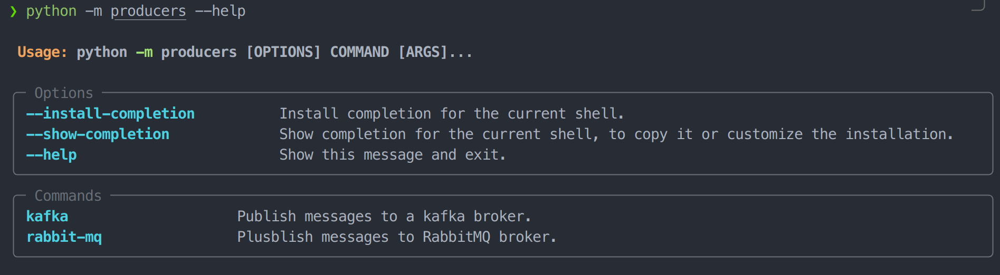
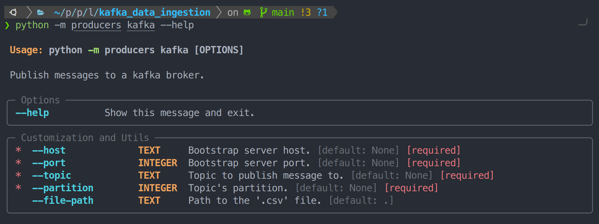
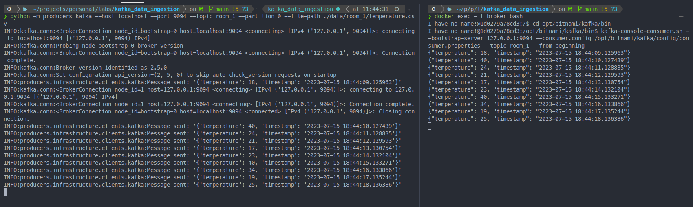
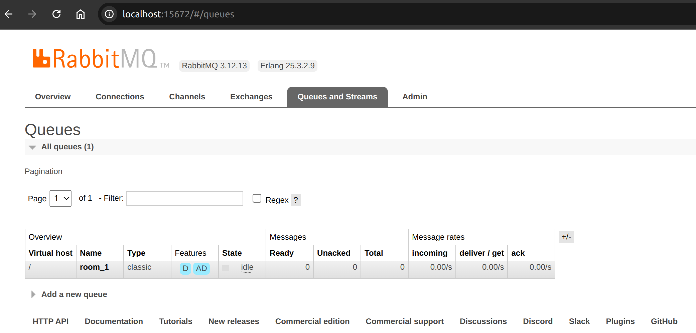
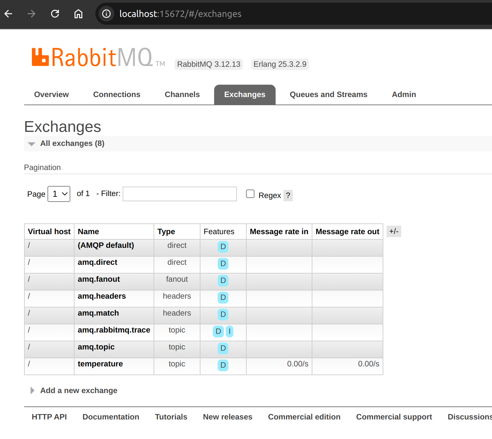
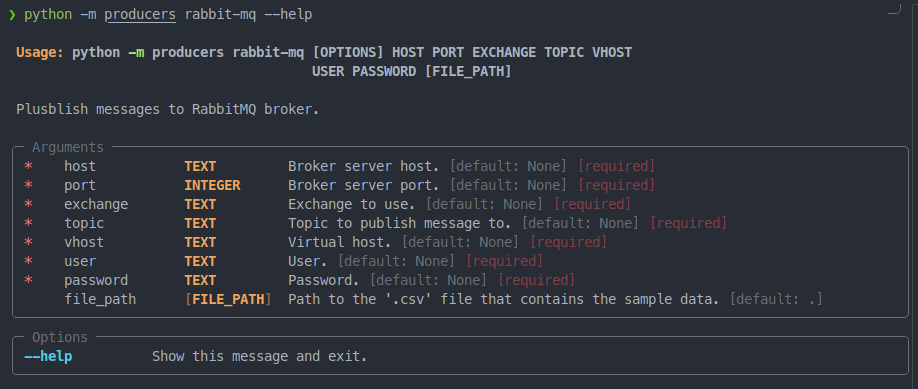
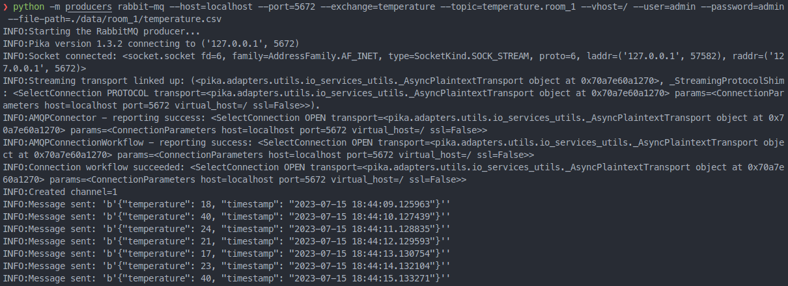
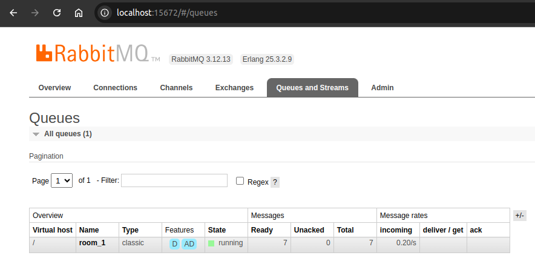
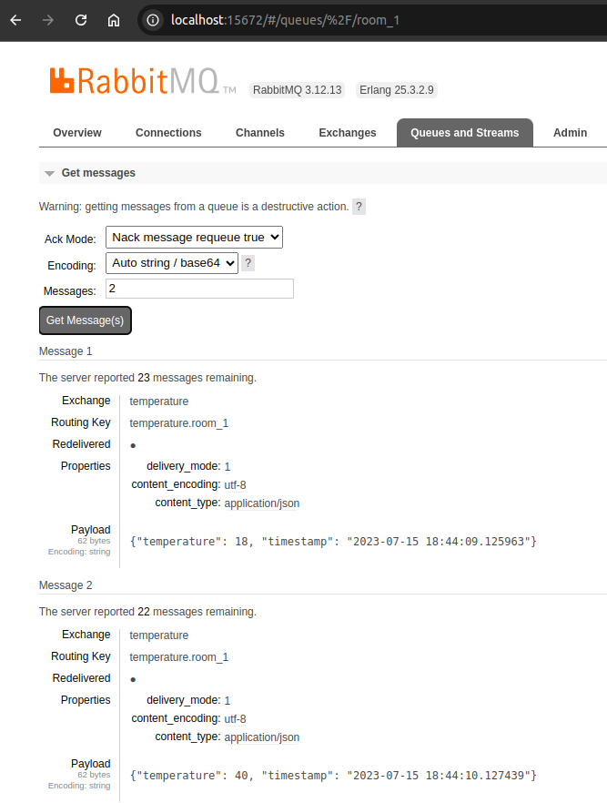

# Data ingestion using Python Producers

## Requirements

- Python ^3.9
- Docker Engine version 1.13.1+, and higher

## Introduction

The first step in almost every data project is data ingestion.
Regardless of the data's location or format, you must find a way to
transform it into an incoming data flow for your project. This allows
you to clean, process, and ultimately generate insights or build
machine-learning models from it.

In this project, we aim to build and connect the necessary components
for a data ingestion setup using Kafka or RabbitQM and Python. For the sake of
simplicity, we will be using a *'.csv'* file as the data source and
simulate a continuous incoming data flow with its data. Think of it as
something similar to a temperature sensor or stock prices during open
hours.

You can check the Python Kafka Medium article for this project in: [A Python Kafka Producer](https://bit.ly/python-kafka-producer)
You can check the Python RabbitMQ Medium article for this project in: [A Python RabbitMQ Producer]()


## Quickstart

Create and active your virtual environment.

* Poetry option:

```poetry install```

* pip option:

I have created a `requirements.txt` from the `pyproject.toml` file. Due to this, you can install dependencies using pip.

```pip install -r requirements.txt```

The first thing you need to do is start a *Broker* (a *Broker* is a server which has Kafka running on it). For this, we are going to use a `docker-compose.yaml` file to set up the *Broker* service.


```bash
docker compose up -d
```

## Kafka data ingestion setup

Now that we have a the Kafka *broker* running, we need to tell it how to organize the incomming data. For this, the *broker* organizes and store the incomming messages (events) in *topics*. *"Very simplified, a topic is similar to a folder in a filesystem, and the events are the files in that folder".* Let's tell the broker where to put all this incomming data:

Now that we have the Kafka Broker up and running, it's time to let it know how to handle all the incoming data. Basically, the *Broker* organizes and stores those incoming messages (which we'll call events) into topics. Think of topics like folders in a file system, and the events are like the files inside those folders. So, let's tell the broker where to put all this incoming data:

1. Open an interective terminal in the *Broker* container:

```bash
docker exec -it broker bash
```

2. Then, navigate to the following directory`/opt/bitnami/kafka/bin`:
```bash
cd opt/bitnami/kafka/bin
```

3. Create a topic:

Let's create our first topic:
```bash
kafka-topics.sh --create --bootstrap-server 127.0.0.1:9094 --replication-factor 1 --partitions 1 --topic room_1
```

As a result, you shoul see something like the following:


NOTE: Pay attention to the warning message as it is important to be aware of the limitations regarding the topic name.


Now, let's test if a producer can send messages to the topic we just created. Run the following command:

```bash
kafka-console-producer.sh --bootstrap-server 127.0.0.1:9094 --producer.config /opt/bitnami/kafka/config/producer.properties --topic room_1
```
This command allows you to write as many messages as you want. The topic will receive and store these messages until a Consumer processes them (Press CTRL-C to stop sending messages). You can keep this producer active to continue sending messages. In the next step, you will see the consumer receiving these messages.


4. Consume messages from a topic:

Once the message/s have been sent, let's cosume the hole stream of messages, since the first one (pay attention to the flag '--from-beginning'):

In a new terminal, execute the steps 1 and 2 and then run:

```bash
kafka-console-consumer.sh --bootstrap-server 127.0.0.1:9094 --consumer.config /opt/bitnami/kafka/config/consumer.properties --topic room_1 --from-beginning
```

NOTE: For this example, once a message have been consumed by a Consumer it is not available anymore.

You should see something like the following:


### Data ingestion using a Python Kafka Producer

Now that we have a running Broker server, we can connect a data source (a Producer) to it. For this purpose, I have created a CLI Python application that launches Producers to read data from a file and continuously send it to the Kafka topic, let’s see how to do it.

```bash
python -m producers --help
```


Let’s inspect the Kafka command:

```bash
python -m producers kafka --help
```


To start a Kafka Producer that publishes messages directly to the ‘room_1’ topic we created

Open a new terminal in the project's root directory and run:

```bash
python -m producers kafka --host localhost --port 9094 --topic room_1 --partition 0 --file-path ./data/room_1/temperature.csv
```

Once the Producer is running you will be able to consume these messages. Do you Remember step 4 in the last section that we use to consume messages from the topic? ok, let’s repeat these steps and you should see something like the following:




## RabbitMQ data ingestion setup

Once you have a RabbitMQ *Broker node* up and running, you can use the Management plug in enable by default in the image we are using and check its status: [Management plugin - Overview](http://localhost:15672/#/)






As you can see, we have successfully configured our *Broker node* with the topic *Exchange* "**temperature**" and the *Queue* "**room_1**".


## Data ingestion using a Python RabbitMQ Producer

Now let's send some data to our *Broker node*, specifically to our *Queue* "**room_1**". To do this,I have created a CLI Python application that read data from a file and continuously sends it to our *queue* by using a RabbitMQ Producer, let’s see how to do it.

```bash
python -m producers --help
```


Let’s inspect the RabbitMQ command:

```bash
python -m producers rabbit-mq --help
```


To start a RabbitMQ Producer that publishes messages directly to the "*room_1*" Queue we created

Open a new terminal in the project's root directory and run:

```bash
python -m producers rabbit-mq --host=localhost --port=5672 --exchange=temperature --topic=temperature.room_1 --vhost=/ --user=admin --password=admin --file-path=./data/room_1/temperature.csv
```



Once the Producer is running, you will be able to see and consume these messages. Do you remember the **Management plugin** we used earlier to check our Queues? Let's go to that view, and you should see the number of messages in the "**room_1**" *queue* start to increase.



Finally, you can manually consume these messages to confirm that our Producer is working. To do this, inspect the "*room_1*" *queue* by clicking on it and scrolling down to the 'Get messages' section. Once there, let's get the first two messages we sent.


