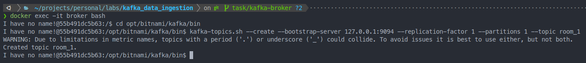
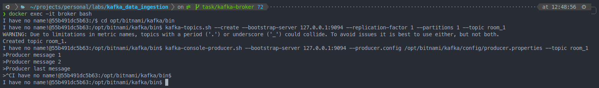
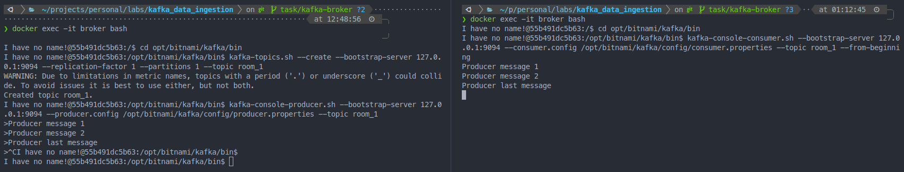

# Data ingestion using kafka

## Requirements

- Python ^3.9
- Docker Engine version 1.13.1+, and higher

## Introduction

The first part for every Data projects is the data ingestion. No matter where the data is located or wich format it has, you must find a way to trandform it into and incomming "data flow" to you project in order to clean, process and finally produce some insights or build some machine learning model from it. 

In this project, basically, we are going to build and connect the requiered pieces to build a Data ingestion setup using Kafka and Python. 

This time, for simplicity, we are using a `.csv` file as data source and simulate, with its data, a continous incomming data flow to us: something like a a temperature sensor or stock price during open hours.


## Quickstart

The first thing you need to do is start a *Broker* (a *Broker* is a server which has Kafka running on it). For this, we are going use a simple `docker-compose.yaml` to start the *Broker*

```bash
docker compose up -d
```

Now that we have a the Kafka *broker* running, we need to tell it how to organize the incomming data. For this, the *broker* organizes and store the incomming messages (events) in *topics*. *"Very simplified, a topic is similar to a folder in a filesystem, and the events are the files in that folder".* Let's tell the broker where to put all this incomming data:

1. Open an interective terminal in *broker* container:

```bash
docker exec -it broker bash
```

2. Move to the following directory `/opt/bitnami/kafka/bin`:
```bash
cd opt/bitnami/kafka/bin
```

3. Create a topic:

Let's create our first topic:
```bash
kafka-topics.sh --create --bootstrap-server 127.0.0.1:9094 --replication-factor 1 --partitions 1 --topic room_1
```

As a result, you shoul see something like the following:


NOTE: pay attention to the warning message, it is impotant to be awere of this topic name limitations.


3. Test that a Producer can send messages to the topic that we have just created

In the same terminal excute:

```bash
kafka-console-producer.sh --bootstrap-server 127.0.0.1:9094 --producer.config /opt/bitnami/kafka/config/producer.properties --topic room_1
```
This command, let's you to write as many messages as you want. The topic will receive these messages and store them until a Consumer process them (Press CTRL-C to stop sending messages). You can let this producer active to keep sending messages, you will see the consumer receive these messages in the next step.



4. Consume messages from a topic:

Once the message/s have been sent, let's cosume the hole stream of messages, since the first one (pay attention to the flag '--from-beginning'):

In a new terminal, execute the steps 1 and 2 and then run:

```bash
kafka-console-consumer.sh --bootstrap-server 127.0.0.1:9094 --consumer.config /opt/bitnami/kafka/config/consumer.properties --topic room_1 --from-beginning
```

NOTE: For this example, once a message have been consumed by a Consumer it is not available anymore.

You should see something like the following:



### Data ingestion using Python

Now that we have a running Broker server we can connect a data-source (a Producer) to it. 
For this, I have created a CLI Python application to luanch Producers that reads data from a file and send it continously to the Kafka topic.

To start a Kafka Producer that publish messages directly to the topic 'room_1' that we have created:

```bash
python -m producers kafka --host localhost --port 9094 --topic room_1 --partition 0 --file-path ./data/room_1/temperature.csv
```

This command simulates a continuous data flow to the Kafka broker.